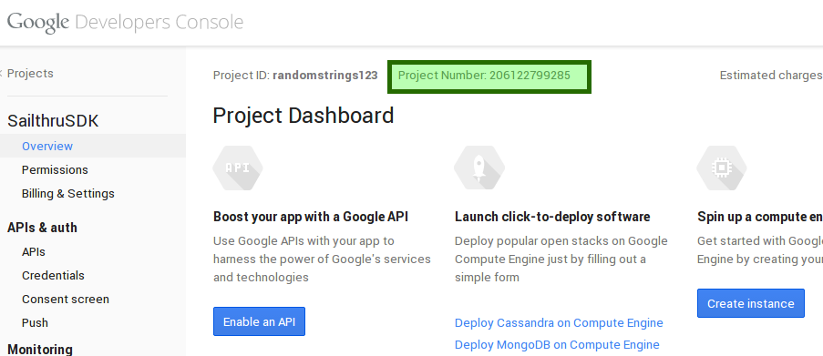

Sailthru Android SDK Library
=======================

Product Features
-----
####Supported Features
The Sailthru Android SDK provides:
*  User registration
*  Anonymous user support 
*  Profile data acquisition 
*  Recommendation delivery 

Client Setup
-----

###Dependency
The Sailthru Android SDK uses the Google Play Services Library and needs to be imported.

###JAR
Download the [SailthruAndroidSDK] jar

#####For Android Studio,
Add the SailthruSDK jar to a <code>libs/</code> folder in your project root.  
In your <code>build.gradle</code>,  

    dependencies {
        ...
        compile files('libs/com.sailthru.android-1.0.1.jar')
        compile 'com.google.android.gms:play-services:5.+'
        ...
    }
    
#####For Eclipse,

  - Add the Sailthru SDK jar to the <code>libs/</code> folder in your project root and refresh you project.
  - Copy the library project at <android-sdk>/extras/google/google_play_services/libproject/google-play-services_lib/ to the location where you maintain your Android app projects.
  - Import the library project into your Eclipse workspace. Click File > Import, select Android > Existing Android Code into Workspace, and browse to the copy of the library project to import it.
  - In your app project, reference Google Play services library project.
  
###Gradle
    dependencies {
            ...
            compile 'com.sailthru:com.sailthru.android:1.+'
            compile 'com.google.android.gms:play-services:5.+'
            ...
        }
        
###Maven
    <dependency>
      <groupId>com.sailthru</groupId>
      <artifactId>com.sailthru.android</artifactId>
      <version>1.0.1</version>
    </dependency>
    
###Android Manifest
Update your <code>AndroidManifest.xml</code> including the following code.

    <?xml version="1.1" encoding="utf-8"?>
    <manifest xmlns:android="http://schemas.android.com/apk/res/android"
        >
        ...
    
        <uses-permission android:name="android.permission.INTERNET" />
        <uses-permission android:name="android.permission.ACCESS_NETWORK_STATE" />
        
        ...
        
        <application
            >
            ...
    
            <meta-data android:name="com.google.android.gms.version"
                android:value="@integer/google_play_services_version" />
    
            ...
            
            <receiver
                android:name="com.sailthru.android.sdk.impl.receivers.SailthruNetworkReceiver"
                android:enabled="true" >
                <intent-filter>
                    <action android:name="android.net.conn.CONNECTIVITY_CHANGE" />
                </intent-filter>
            </receiver>
    
            <service android:name="com.sailthru.android.sdk.impl.event.SailthruAppTrackService" />
    
            ...
            
        </application>
    
    </manifest>

Initialization
---------------
Initialize the SDK in an <code>Application</code> class,
    
    public class MyApplication extends Application {
    
        Sailthru mSailthru;
        
        ...
        
        @Override
            public void onCreate() {
                super.onCreate();
                mSailthru = new Sailthru(getApplicationContext());
                ...
            }
            
        ...
        
        public Sailthru getSailthruInstance() {
            return mSailthru;
        }
        
        ...
    }
    
And Access the Sailthru client in your classes,
    
    public class MyActivity extends Activity {
    
        @Override
        protected void onCreate(Bundle savedInstanceState) {
            super.onCreate(savedInstanceState);
            setContentView(R.layout.my_activity);
            
            Sailthru sailthru = ((SailthruQAClientApplication) getApplicationContext()).getSailthruInstance();
            ...
        }
    }
    
Or,

    public class MyFragment extends Fragment {
        
        @Override
        protected void onCreate(Bundle savedInstanceState) {
            super.onCreate(savedInstanceState);
            
            Sailthru sailthru = ((SailthruQAClientApplication) getActivity().getApplicationContext()).getSailthruInstance();
            ...
        }
    }
    

User Register
---------------
The UserRegister method accepts the following parameters,

  - <code>environment</code>    : RegistrationEnvironment. (__DEV__ or __PROD__). 
  - <code>domain</code>         : String. Created in the [Sailthru] dashboard.
  - <code>apiKey</code>         : String. Can be found in the [Sailthru] dashboard. 
  - <code>appId</code>          : String. Can be found in the [Sailthru] dashboard.
  - <code>identification</code> : Identification. (__EMAIL__ or __ANONYMOUS__).
  - <code>uid</code>            : String. Email of user if <code>identification</code> is __EMAIL__. <code>null</code> if <code>identification</code> is __ANONYMOUS__.
  - <code>platformAppId</code>  : String. Can be found in the [Sailthru] dashboard.
  - <code>projectNumber</code>  : String. The GCM Project Number also referred to as the SENDER_ID. This can be obtained from the Google Cloud console by following instructions shown below in the Google setup section.
  
There are two types of registrations, Anonymous and Email,

###Anonymous
    
    mSailthru.register(RegistrationMode.PROD, "example.sailthru.com", "000000", "123456", Identification.ANONYMOUS, null, "com.example", "0123456789");
    
###Email

    mSailthru.register(RegistrationMode.PROD, "example.sailthru.com", "000000", "123456", Identification.EMAIL, "jdoe@sailthru.com", "com.example", "0123456789");

AppTrack
-------------
The AppTrack call accepts the following parameters,  

  - <code>tags</code>      : List<String> 
  - <code>url</code>       : String
  - <code>latitude</code>  : String
  - <code>longitude</code> : String
  
####It is required to have atleast one tag or a url in a request.
    mSailthru.sendAppTrackData(tagList, url, latitude, longitude);

Recommendations
----------------
The Recommend call is a network call that returns a json string containing recommendations. This call 
needs to be made off of the UI thread(AsyncTask or Service) and accepts the following parameters,

  - <code>count</code> : int. The maximum number of recommendations to return.
  - <code>tags</code>  : List<String>. Return only items that match all of the given tags.

Example call,  

    mSailthru.getRecommendations(count, tags);  

Logging
----------
There are 3 Log Levels you can choose from to display logs.  

  - NONE   : No logs will be displayed.
  - BASIC  : Only basic information will be logged.
  - FULL   : All logs including network requests/responses are logged.
  
You can set the <code>LogLevel</code> in the following way,  
    
    mSailthru.setLogLevel(logLevel);
  
If you need to take a closer look at the requests, responses and other log messages, you can intercept logs using a custom implementation of the <code>Logger</code>. You can also set the <code>LogLevel</code> property.  

    Logger logger = new Logger() {
        @Override
        protected void d(LogLevel logLevel, String s, String s2) {
            ...
        }

        @Override
        protected void w(LogLevel logLevel, String s, String s2) {
            ...
        }

        @Override
        protected void e(LogLevel logLevel, String s, String s2) {
            ...
        }
    };
    
    logger.setLogLevel(LogLevel.FULL);
    
    mSailthru.setLogger(logger);
  
The <code>LogLevel</code> is set to <code>BASIC</code> by default.
[SailthruAndroidSDK]:https://oss.sonatype.org/service/local/artifact/maven/redirect?r=releases&g=com.sailthru&a=com.sailthru.android&v=1.0.1&e=jar
[Sailthru]:https://my.sailthru.com/

Google Setup
-----

The Sailthru Android SDK requires a Google Project be created. The Google Project should have the "Google Cloud Messaging for Android" API enabled. To enable the api follow the directions below.

Navigate to the [Google Developers Console](https://console.developers.google.com/)

Create a new project

Give the project a name and a project ID.

Agree to Google's Terms of Service

Note the Project Number as it is will be required to add to the SDK as the "SENDER_ID"

Enable "Google Cloud Messaging for Android" in the API section

That's it. It should be noted that there are no quotas for Google Cloud Messaging for Android. More info can be [found here] (https://developer.android.com/google/gcm/c2dm.html#history)
